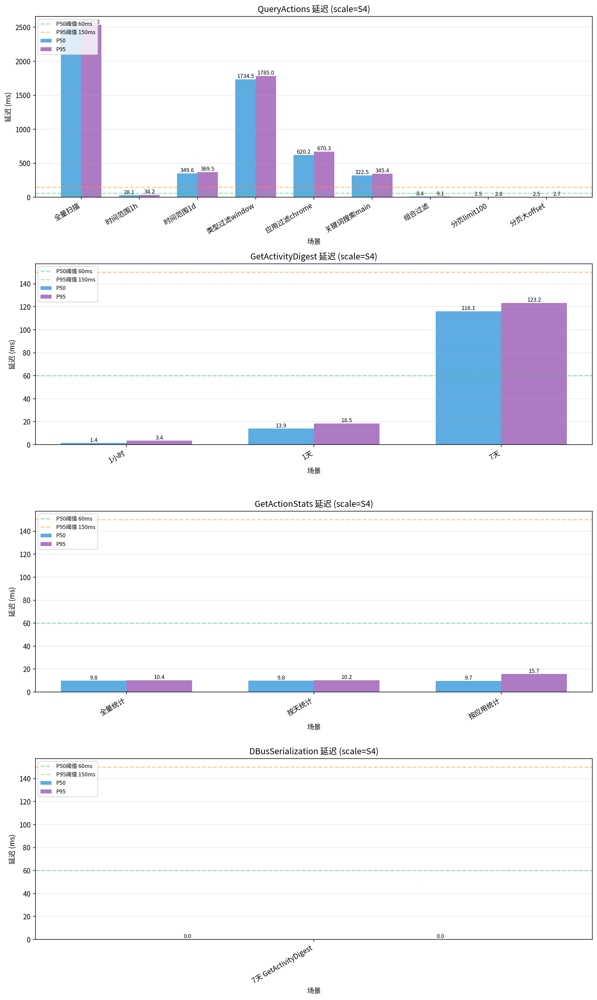
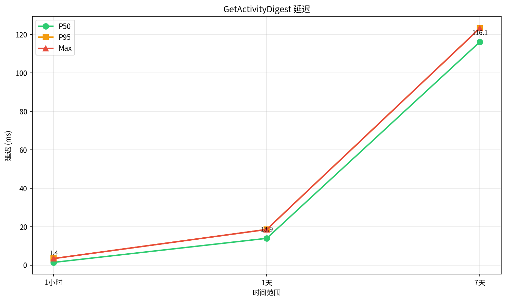
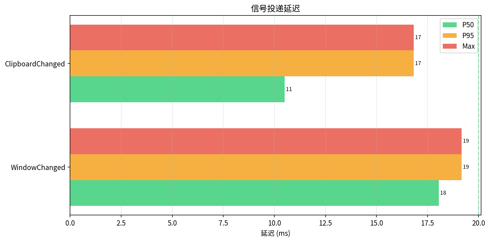
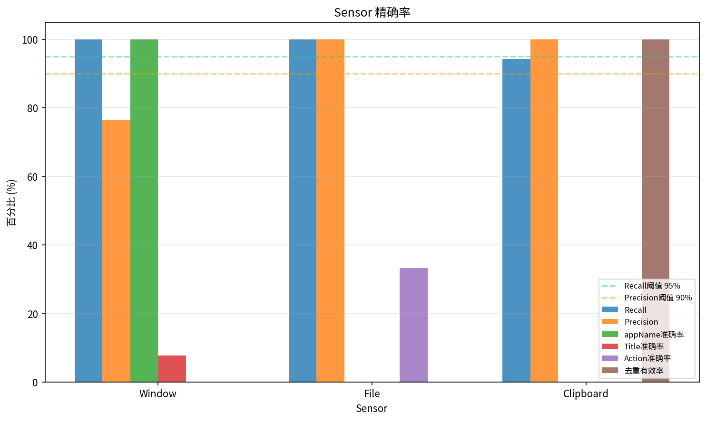
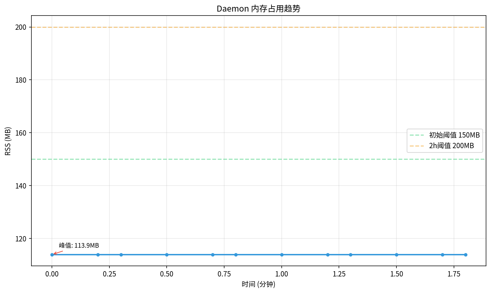
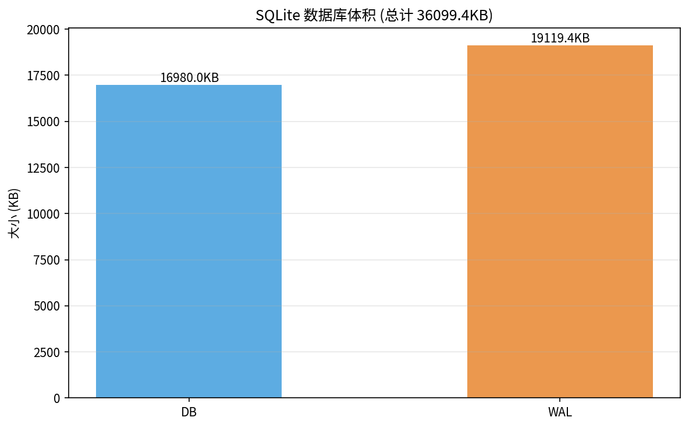
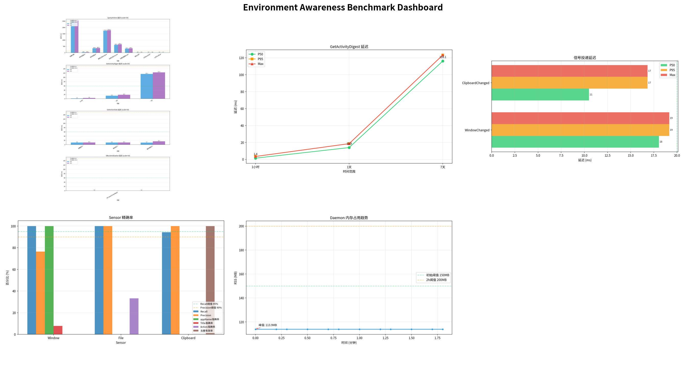

# Benchmark Report

> 日期：2026-07-17T10:35:41.421771
> Commit：bed3504
> 规模：S4

## 查询性能

阈值 (scale=S4): P50<60ms, P95<150ms, Max<300ms

| Method | Scenario | P50 (ms) | P95 (ms) | Max (ms) | Status |
|---|---|---|---|---|---|
| QueryActions | 全量扫描 | 2498.98 | 2535.2 | 2535.2 | FAIL |
| QueryActions | 时间范围1h | 28.15 | 34.2 | 34.2 | PASS |
| QueryActions | 时间范围1d | 349.62 | 369.53 | 369.53 | FAIL |
| QueryActions | 类型过滤window | 1734.52 | 1784.95 | 1784.95 | FAIL |
| QueryActions | 应用过滤chrome | 620.25 | 670.34 | 670.34 | FAIL |
| QueryActions | 关键词搜索main | 322.52 | 345.41 | 345.41 | FAIL |
| QueryActions | 组合过滤 | 8.44 | 9.11 | 9.11 | PASS |
| QueryActions | 分页limit100 | 2.51 | 2.83 | 2.83 | PASS |
| QueryActions | 分页大offset | 2.53 | 2.7 | 2.7 | PASS |
| GetActivityDigest | 1小时 | 1.39 | 3.39 | 3.39 | PASS |
| GetActivityDigest | 1天 | 13.91 | 18.53 | 18.53 | PASS |
| GetActivityDigest | 7天 | 116.14 | 123.25 | 123.25 | WARN |
| GetActionStats | 全量统计 | 9.85 | 10.36 | 10.36 | PASS |
| GetActionStats | 按天统计 | 9.82 | 10.16 | 10.16 | PASS |
| GetActionStats | 按应用统计 | 9.72 | 15.67 | 15.67 | PASS |
| DBusSerialization | 7天 GetActivityDigest | 0 | 0 | 0 | PASS |

## 信号延迟

| Signal | P50 (ms) | P95 (ms) | Max (ms) | Status |
|---|---|---|---|---|
| WindowChanged | 18.05 | 19.17 | 19.17 | PASS |
| ClipboardChanged | 10.51 | 16.83 | 16.83 | PASS |

## Sensor 精确率

| Sensor | Recall (%) | Precision (%) | appName准确率 (%) | Title准确率 (%) | Status |
|---|---|---|---|---|---|
| Window | 100.0 | 76.5 | 100.0 | 7.7 | WARN |
| File | 100.0 | 100.0 | 0 | 0 | PASS |
| Clipboard | 94.4 | 100.0 | 0 | 0 | FAIL |

## 资源开销

| Metric | Value | Threshold | Status |
|---|---|---|---|
| 初始 RSS | 113.9MB | <150MB | PASS |
| 峰值 RSS | 113.9MB | <200MB | PASS |

| Metric | Value |
|---|---|
| DB 大小 | 16980.0KB |
| WAL 大小 | 19119.4KB |
| 总计 | 36099.4KB |

## 仪表盘总览

## 交互式仪表盘

打开 `dashboard.html` 查看交互式图表。
